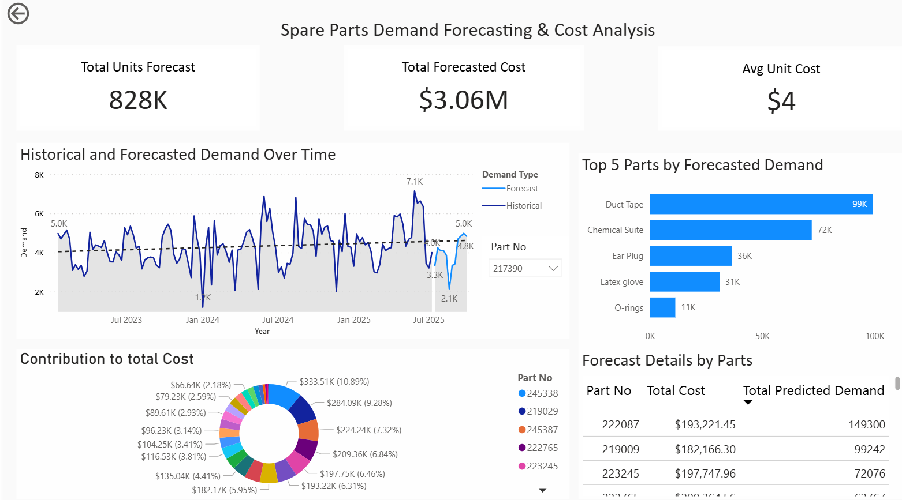

# Spare Parts Demand Forecasting & Cost Analysis

[Link](https://app.powerbi.com/links/8jHUCUA8ZN?ctid=2b696feb-af52-4f0a-a77c-581167489d4f&pbi_source=linkShare&bookmarkGuid=b1117bea-7ff1-4025-93f8-8489f5e77854) to PowerBI

## Problem Statement
During my internship at a servicing company, I identified a significant challenge in accurately forecasting the demand for spare parts. The existing methods were not sufficiently reliable, leading to either overstocking or stockouts, which in turn affected customer satisfaction and operational efficiency. To address this issue, I embarked on a project to develop a robust demand forecasting model and conduct a comprehensive cost analysis.

## Overview
This project focuses on forecasting demand for spare parts and analyzing associated costs to optimize inventory management. It leverages historical data, predictive analytics, and key performance indicators (KPIs) to support decision-making in supply chain operations.

Features
--------

-   **Demand Forecasting**: Visualizes "Historical and Forecasted Demand Over Time" using a line chart that compares actual historical data against predicted values through mid-2025.

-   **Cost Analysis**: Break down of financial metrics, including a "Contribution to Total Cost" donut chart that visualizes the percentage and dollar value impact of specific part numbers.

-   **Key Performance Indicators (KPIs)**:

    -   **Total Units Forecast**: High-level metric tracking the total volume of predicted demand (828K).

    -   **Total Forecasted Cost**: Aggregates the projected financial requirement for the forecasted period ($3.06M).

    -   **Avg Unit Cost**: Monitors the average cost per unit ($4) to track pricing trends.

-   **Inventory Ranking**: A "Top 5 Parts by Forecasted Demand" bar chart that identifies high-volume inventory items (e.g., Duct Tape, Chemical Suits) to prioritize stock management.

-   **Granular Data View**: A "Forecast Details by Parts" table providing row-level specifics on Part Numbers, associating their Total Cost directly with Total Predicted Demand.

-   **Interactive Filtering**: Includes specific slicers (e.g., "Part No") to dynamically filter the charts and metrics for individual inventory items.

## Technologies Used
- **Programming Languages**: Python (for data analysis), DAX (for Power BI calculations)
- **Tools**: Power BI, Excel, Jupyter Notebook
- **Libraries**: Pandas, NumPy, Scikit-learn (for forecasting models)
- **Version Control**: Git, GitHub

## Contact
For questions or feedback, feel free to reach out via [chidubemjan31@gmail.com](mailto:chidubemjan31@gmail.com) or open an issue on GitHub.